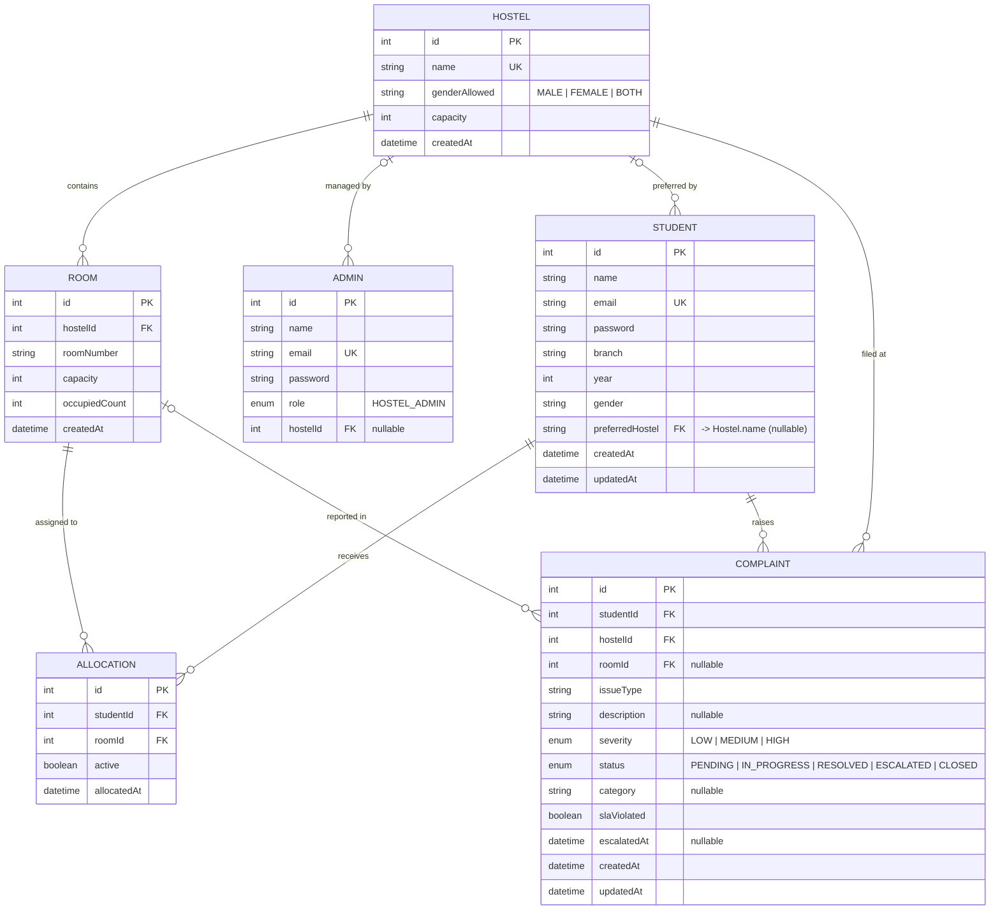

# Entity–Relationship Diagram — Smart Hostel Management System

This ERD reflects the **actual database** defined in
[`backend/prisma/schema.prisma`](../../backend/prisma/schema.prisma) (PostgreSQL),
including the integrity fixes: `Hostel.name` is unique, and `Student.preferredHostel`
is a foreign key into `Hostel.name`.

> Notation: crow's‑foot (Mermaid). `PK` = primary key, `FK` = foreign key,
> `UK` = unique key. GitHub renders the diagram below automatically.

## Relationships

| Relationship                  | Cardinality | Meaning                                                                    |
| ----------------------------- | ----------- | -------------------------------------------------------------------------- |
| Hostel — Room                 | 1 : N       | A hostel contains many rooms; each room belongs to one hostel.             |
| Hostel — Admin                | 1 : N       | A hostel is managed by admin(s); each admin belongs to one hostel.         |
| Hostel — Student (preference) | 1 : N       | A student _prefers_ one hostel (optional); a hostel is preferred by many.  |
| Student — Allocation          | 1 : N       | A student can have allocation history; only **one is `active`** at a time. |
| Room — Allocation             | 1 : N       | A room is assigned across many allocations over time.                      |
| Student — Complaint           | 1 : N       | A student raises many complaints.                                          |
| Hostel — Complaint            | 1 : N       | Each complaint is filed against one hostel.                                |
| Room — Complaint              | 0..1 : N    | A complaint may optionally reference the room it concerns.                 |

`ALLOCATION` is an **associative (junction) entity** resolving the many‑to‑many
relationship between `STUDENT` and `ROOM`, enriched with `active` and `allocatedAt`.

## Key constraints / business rules

- `Student.email`, `Admin.email`, and `Hostel.name` are **unique**.
- `Room(hostelId, roomNumber)` is a **composite unique** key.
- `Student.preferredHostel` must match an existing `Hostel.name` (FK); `ON DELETE SET NULL`, `ON UPDATE CASCADE`.
- A student never occupies a full room (`occupiedCount < capacity` enforced by the allocation service).
- A complaint that breaches its category SLA is set to `ESCALATED` with `slaViolated = true`.
